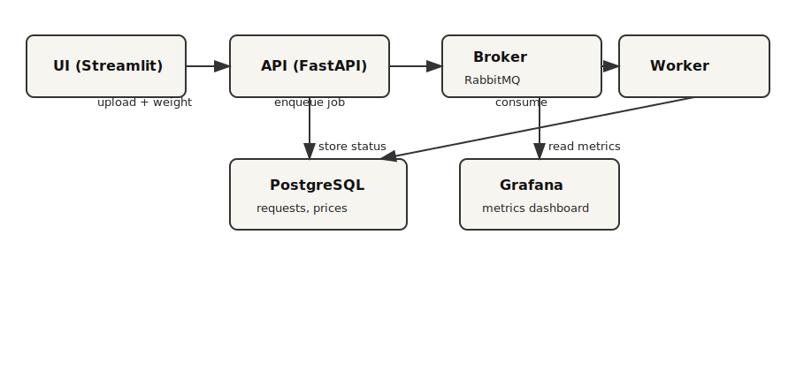

# Project is done by:
- Мазуренко Тимофей
- Бохян Роман

# SmartScale

SmartScale is a minimal system that auto-classifies produce from a scale-mounted camera image and computes price by weight. It demonstrates async inference, storage, UI, and monitoring in a reproducible Docker Compose setup.

## Business value
- Reduce self-checkout friction by removing manual produce search.
- Increase pricing accuracy with consistent label selection.
- Surface operational metrics to monitor model quality and system health.

## Architecture



**Flow**: UI uploads image + weight → API stores request → broker queues task → worker runs inference → DB stores results → UI polls API → Grafana reads metrics.

## Quickstart

```bash
docker-compose up --build
```

After startup:
- UI: http://localhost:8501
- API docs (Swagger): http://localhost:8000/docs
- Grafana: http://localhost:3000 (admin/admin)
- RabbitMQ UI: http://localhost:15672 (guest/guest)

## Demo steps
1. Open the UI and upload a sample image from `sample_data`.
2. Enter a weight (kg) and click **Classify**.
3. Wait for the prediction; review label, confidence, top-K, and price.
4. If confidence is low, confirm the correct label (stored in DB).
5. Switch to **Analytics** or open Grafana to view metrics.

## API summary
Base path: `/v1`

- `POST /predict` (multipart) → returns `job_id`
- `GET /result/{job_id}` → status + result
- `GET /history` → stored predictions
- `GET /health`
- `POST /admin/reload-model` (requires `X-Admin-Token`)
- `GET /admin/model` (requires `X-Admin-Token`)
- `POST /confirm/{job_id}` → store user-confirmed label

## Model hot reload
The worker checks the `model_registry` table before each task. To trigger a reload without stopping containers:

```bash
curl -X POST http://localhost:8000/v1/admin/reload-model \
  -H "X-Admin-Token: changeme" \
  -H "Content-Type: application/json" \
  -d '{"model_revision":"main"}'
```

Subsequent jobs will use the new model revision while containers keep running.

## Monitoring
Grafana is pre-provisioned with a Postgres datasource and dashboard. Panels include:
- Total requests
- Avg / p95 latency
- Low-confidence rate
- Top labels
- Error count

## Repo structure
- `api/` FastAPI service
- `worker/` Celery worker + HF model
- `ui/` Streamlit app
- `db/` Postgres init SQL
- `grafana/` provisioning + dashboards
- `docs/architecture.svg`
- `one_pager.pdf`
- `sample_data/`

## Notes
- Default admin token is `changeme` (set `ADMIN_TOKEN` in compose for production use).
- Default model is `Adriana213/vgg16-fruit-classifier` (TF/Keras VGG16).
- HF cache is stored in `./model_cache` to avoid re-downloading.
- Logs are written to `./logs` and stdout.
