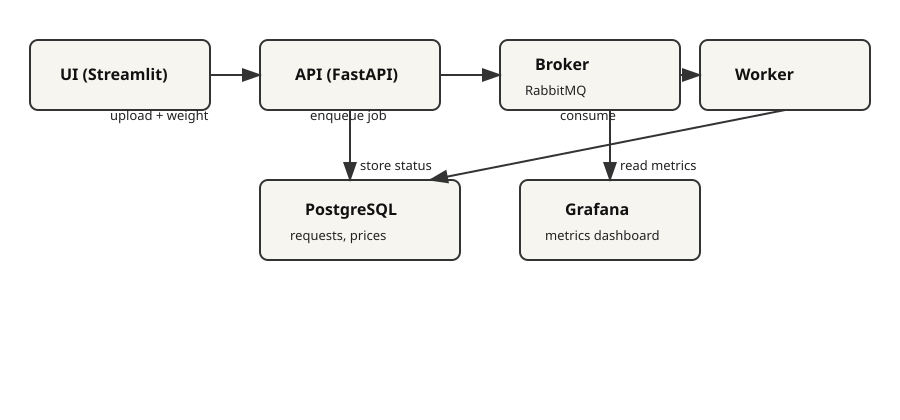

# Project is done by:
- Мазуренко Тимофей
- Бохян Роман

# SmartScale

SmartScale is a Visual RAG (Retrieval-Augmented Generation) system for produce recognition on self-checkout scales. Instead of classifying produce into fixed categories, it embeds query images with DINOv2 and retrieves the most visually similar items from a reference database, displaying them alongside similarity scores for user confirmation.

## How it works

1. User places produce on the scale and uploads a photo.
2. The system embeds the photo using **DINOv2** (facebook/dinov2-base).
3. Cosine similarity is computed against all reference image embeddings stored in **pgvector**.
4. Top-10 most similar reference images are returned with captions and similarity scores.
5. Price is looked up for the best match and multiplied by weight.

## Architecture



**Flow**: UI uploads image + weight → API stores request → broker queues task → worker embeds image with DINOv2 + queries pgvector → DB stores results → UI polls API and displays visual matches → Grafana reads metrics.

**Key components**:
- **DINOv2** (facebook/dinov2-base) — self-supervised ViT for embedding images into 768-dim vectors
- **pgvector** — PostgreSQL extension for vector similarity search (HNSW index, cosine distance)
- **Reference DB** — 100+ fruits/vegetables, ~200 reference images with pre-computed embeddings

## Quickstart

```bash
# Start all services
docker compose up --build -d

# Wait for services to start, then populate the reference database
docker compose exec worker python /app/scripts/build_reference_db.py \
  --source-dir /data/reference \
  --db-url postgresql+psycopg2://smartscale:smartscale@db:5432/smartscale
```

After startup:
- UI: http://localhost:8501
- API docs (Swagger): http://localhost:8000/docs
- Grafana: http://localhost:3000 (admin/admin)
- RabbitMQ UI: http://localhost:15672 (guest/guest)

## Demo steps
1. Open the UI and upload a sample image from `sample_data/`.
2. Enter a weight (kg) and click **Recognize**.
3. Review the top-10 visual matches with similarity scores.
4. If the top match has low similarity, confirm the correct label manually.
5. Switch to **Analytics** or open Grafana to view metrics.

## API summary
Base path: `/v1`

| Method | Endpoint | Description |
|--------|----------|-------------|
| POST | `/predict` | Submit image for recognition (returns `job_id`) |
| GET | `/result/{job_id}` | Poll for recognition results |
| GET | `/history` | Query past predictions |
| GET | `/health` | Health check |
| POST | `/confirm/{job_id}` | Store user-confirmed label |
| POST | `/reference/upload` | Upload a new reference image (requires `X-Admin-Token`) |
| GET | `/reference` | List reference images |
| POST | `/admin/reload-model` | Update model in registry (requires `X-Admin-Token`) |
| GET | `/admin/model` | Get current model info (requires `X-Admin-Token`) |

## Adding reference images

### Via API
```bash
curl -X POST http://localhost:8000/v1/reference/upload \
  -H "X-Admin-Token: changeme" \
  -F "image=@photo.jpg" \
  -F "caption=Granny Smith Apple" \
  -F "label=Apple"
```

### Bulk import
Place images in `reference_data/{label}/{variety}.jpg` and run:
```bash
docker compose exec worker python /app/scripts/build_reference_db.py \
  --source-dir /data/reference \
  --db-url postgresql+psycopg2://smartscale:smartscale@db:5432/smartscale
```

### Clear and re-populate
To delete all reference images from the database and re-import:
```bash
# Delete all entries
docker compose exec db psql -U smartscale -c 'DELETE FROM reference_images;'

# Re-populate
docker compose exec worker python /app/scripts/build_reference_db.py \
  --source-dir /data/reference \
  --db-url postgresql+psycopg2://smartscale:smartscale@db:5432/smartscale
```

### Download more images
```bash
python scripts/download_fruits.py --output-dir ./reference_data
```

## Model hot reload
The worker checks the `model_registry` table before each task. To switch models without restarting:

```bash
curl -X POST http://localhost:8000/v1/admin/reload-model \
  -H "X-Admin-Token: changeme" \
  -H "Content-Type: application/json" \
  -d '{"model_id":"facebook/dinov2-base","model_revision":"main"}'
```

## Monitoring
Grafana is pre-provisioned with a Postgres datasource and dashboard. Panels include:
- Total requests
- Avg / p95 latency
- Low-confidence rate
- Top labels
- Error count

## Repo structure
- `api/` — FastAPI service (coordination, static file serving)
- `worker/` — Celery worker (DINOv2 embedding, pgvector retrieval)
- `ui/` — Streamlit app (visual grid display)
- `db/` — PostgreSQL init SQL (pgvector extension, reference_images table)
- `scripts/` — Reference DB population tools
- `reference_data/` — 100+ fruits/vegetables reference images
- `sample_data/` — Test images for demo
- `grafana/` — Dashboard provisioning
- `docs/architecture.svg`

## Technical details
- **Embedding model**: DINOv2-base (768-dim, PyTorch, ~350MB)
- **Vector search**: pgvector with HNSW index, cosine distance operator (`<=>`)
- **Reference DB**: ~200 images across 100 produce categories
- **Async pipeline**: FastAPI → RabbitMQ → Celery worker → PostgreSQL
- **Image serving**: FastAPI StaticFiles for reference images

## Notes
- Default admin token is `changeme` (set `ADMIN_TOKEN` in compose for production).
- Default model is `facebook/dinov2-base` (DINOv2 ViT, self-supervised).
- HF cache is stored in `./model_cache` to avoid re-downloading.
- Logs are written to `./logs` and stdout.
